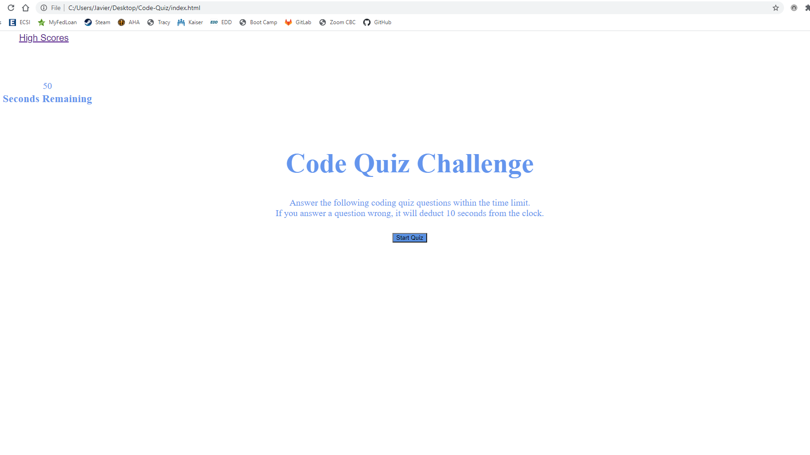

# Code-Quiz

## Site

## Technologies Used
- HTML - Used to create code for the code quiz
- CSS - Used to style the code made in the HTML
- Java Script - Used for creating the advanced features of the application
- Git - Used for pushing data up to the repository
- GitHub - Used for publishing the application
- VS Code - Used for writing the code

## Summary
This application contains a coding quiz where a user starts the quiz by pressing the start button. When the user starts the quiz, the application will display one of five questions with 3 incorrect answers and 1 correct answer. The user then selects an answer and the application moves forward and displays the next question and answers. However, if the user selects a wrong answer, the application will deduct 10 seconds from the timer. At the end of the quiz, the user will be asked to enter their initials and submit it. The submit button will take the user to a new page of high scores. In this page, the user has the option to clear the scores or return to the quiz page.

## 